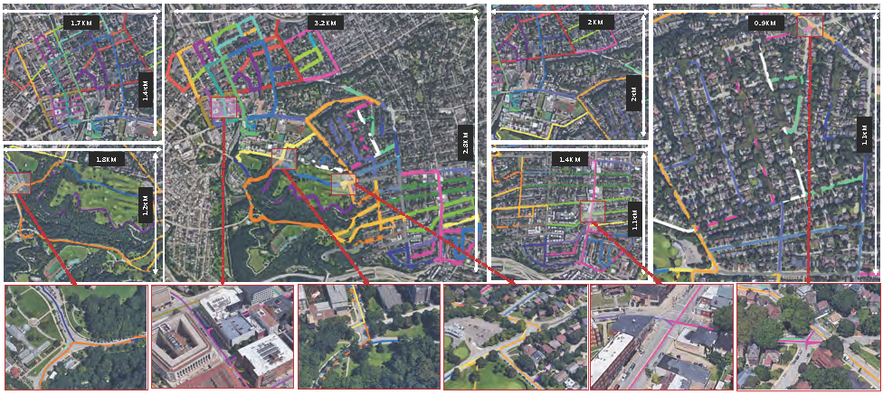
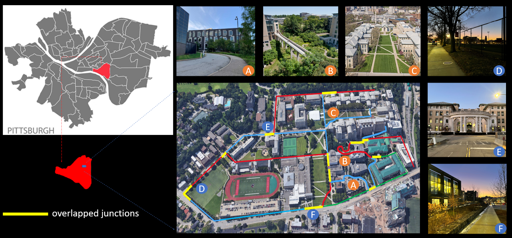

# ALITA
**ALITA: A Large-scale Incremental Dataset for Long-term Autonomy**

## Release 

* **Part of Urban dataset has been released through :trophy:[GPR Competition](https://github.com/MetaSLAM/GPR_Competition/tree/main)** which aims to push visual and LiDAR state-of-the-art techniques for localization in large-scale environments. The final round will start at 30/05/2022, participants who are interested could pay a visit to our [official competition website](https://sites.google.com/andrew.cmu.edu/gpr-competition/) for more details.</br>
  **Sign up for GPR Competition:**</br>
  :point_right: [[ICRA2022] General Place Recognition: City-scale UGV Localization](https://www.aicrowd.com/challenges/icra2022-general-place-recognition-city-scale-ugv-localization/)</br>
  :point_right: [[ICRA2022] General Place Recognition: Visual Terrain Relative Navigation](https://www.aicrowd.com/challenges/icra2022-general-place-recognition-visual-terrain-relative-navigation/)
* **Traning set will be available by the end of May 2022**
* **Python API will be available by the end of May 2022**
* **Entire dataset will be released after GPR Competition**
  
## Dataset Description

ALITA dataset is composed by two dataset wh

- **Urban Dataset**: This dataset concentrates on the LiDAR place recognition over a large-scale area within urban environment. We collected 50 vehicle trajectories covering partial of the Pittsburgh and thus including diverse enviroments. Each trajectory is at least overlapped at one junction with the others, and some trajectories even have multiple junctions. This feature enables the dataset to be used in tasks such as LiDAR place recognition and multi-map fusion.
  

- **Campus Dataset**: This dataset focuses on visual localization for UGVs using omnidirectional cameras within outdoor campus-type environments. We collected 80 real-world UAV sequences using a rover robot equipped with a 360 camera, a Velodyne VLP-16 LiDAR, a RealSense VIO and an Xsens MTI IMU. These consisted of 10 different trajectories. For each trajectory, we traversed 8 times, including forward(start point to endpoint)/backward(endpoint to start point) directions and day-light (2pm to 4:30pm)/dawn-light (6am to 7am or 5pm to 6pm). 8-times includes two forward sequences and two backward sequences during day-light and two forward and two backward sequences during dawn-light.
  

<!-- ## Data Format

## Python API Usage -->

## Citation

If you use this dataset in your research, please cite as:

```
@misc{yin2022alita,
      title={ALITA: A Large-scale Incremental Dataset for Long-term Autonomy}, 
      author={Peng Yin and Shiqi Zhao and Ruohai Ge and Ivan Cisneros and Ruijie Fu and Ji Zhang and Howie Choset and Sebastian Scherer},
      year={2022},
      eprint={2205.10737},
      archivePrefix={arXiv},
      primaryClass={cs.RO}
}
```

## Related Work
**AutoMerge: A Framework for Map Assembling and Smoothing in City-scale Environments**</br>
Peng Yin, Haowen Lai, Shiqi Zhao, Ruijie Fu, Ivan Cisneros, Ruohai Ge, Ji Zhang, Howie Choset, and Sebastian Scherer

Github: https://github.com/MetaSLAM/AutoMerge_Server
