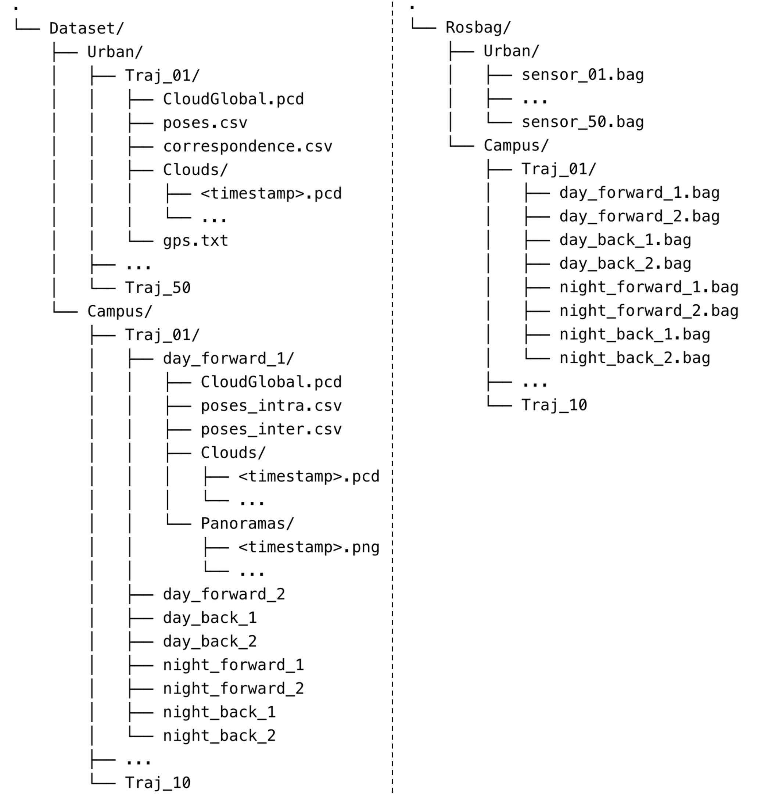

# ALITA
**ALITA: A Large-scale Incremental Dataset for Long-term Autonomy**

## Competition
:trophy:[GPR Competition](https://github.com/MetaSLAM/GPR_Competition/tree/main)** which aims to push visual and LiDAR state-of-the-art techniques for localization in large-scale environments. The final round will start at 06/05/2022, participants who are interested could pay a visit to our [official competition website](https://sites.google.com/andrew.cmu.edu/gpr-competition/) for more details.</br>
:trophy:[General Place Recognition (GPR) for Autonomous Map Assembling](https://metaslam.github.io/competitions/iros2023/)** which aims to evaluate the data association ability between trajectories that exhibit overlapping regions, without any GPS assistance. Participants who are interested could pay a visit to our [official competition website](https://www.aicrowd.com/challenges/icra2022-general-place-recognition-visual-terrain-relative-navigation/) for more details.</br>
  **Sign up for GPR Competition:**</br>
    :point_right: [[ICRA2022] General Place Recognition: Visual Terrain Relative Navigation](https://www.aicrowd.com/challenges/icra2022-general-place-recognition-visual-terrain-relative-navigation/)</br>
  :point_right: [[ICRA2022 & IROS2023] General Place Recognition: City-scale UGV Localization](https://www.aicrowd.com/challenges/icra2022-general-place-recognition-city-scale-ugv-localization/)

## Dataset Release 

* Raw Data https://www.dropbox.com/sh/svxb160qcrq0j3e/AABPvyeOxNPMKuTMERfEcwaPa?dl=0
* Processed Data (human-parseable data) https://www.dropbox.com/scl/fo/9o3uhejbyidxxwlnx912m/h?rlkey=bpryzdghexxez9p1m9100viqd&dl=0
  
## Dataset Description

ALITA dataset is composed by two dataset

- **Urban Dataset**: This dataset concentrates on the LiDAR place recognition over a large-scale area within urban environment. We collected 50 vehicle trajectories covering partial of the Pittsburgh and thus including diverse enviroments. Each trajectory is at least overlapped at one junction with the others, and some trajectories even have multiple junctions. This feature enables the dataset to be used in tasks such as LiDAR place recognition and multi-map fusion.
  

- **Campus Dataset**: This dataset focuses on visual localization for UGVs using omnidirectional cameras within outdoor campus-type environments. We collected 80 real-world UAV sequences using a rover robot equipped with a 360 camera, a Velodyne VLP-16 LiDAR, a RealSense VIO and an Xsens MTI IMU. These consisted of 10 different trajectories. For each trajectory, we traversed 8 times, including forward(start point to endpoint)/backward(endpoint to start point) directions and day-light (2pm to 4:30pm)/dawn-light (6am to 7am or 5pm to 6pm). 8-times includes two forward sequences and two backward sequences during day-light and two forward and two backward sequences during dawn-light.
  

## Data Format


### Urban Dataset
- CloudGlobal.pcd: Global maps are processed to contain
the 3D structure of each trajectory, which is provided
in Point Cloud Data (PCD) file format.
- Intra-sequence Odometry: We save the key poses
generated by SLAM as odometry information and
provide them in (CSV) file format. The key poses are
within the local coordinate of each trajectory, and the
distance between adjacent poses is around 1m.
- Clouds: Based on the global map and poses, submaps
are generated by querying points within 50 meters
centered as each pose from the global map. **This part
of data is not directly provided from the section Dataset Release.** 
This can be generated with the [file.py](file.py) provided.

### Campus Dataset
- Global Maps, Intra-sequence Odometry and Clouds
are processed in the same format with Urban.
- Inter-sequence Odometry: The poses of 8
sequences within the same trajectory are unified into
the same global coordinate and saved in (CSV) file
format. For each trajectory, day_forward_1's coordinate
is selected as the global coordinate.
- Panoramas: For each key pose, a corresponding
omnidirectional picture with a resolution of 1024 ×
512 is provided in (PNG) file format.
- Raw Data: Raw data is also provided in (rosbag)
ROS package. Each rosbag includes three ROS
topics, namely /imu/data, /velodyne points and
/camera/image, representing Inertial Measurement
Unit(IMU), LiDAR and camera, respectively

## Python API Usage

## Citation

If you use this dataset in your research, please cite as:

```
@misc{yin2022alita,
      title={ALITA: A Large-scale Incremental Dataset for Long-term Autonomy}, 
      author={Peng Yin and Shiqi Zhao and Ruohai Ge and Ivan Cisneros and Ruijie Fu and Ji Zhang and Howie Choset and Sebastian Scherer},
      year={2022},
      eprint={2205.10737},
      archivePrefix={arXiv},
      primaryClass={cs.RO}
}
```

## Related Work
**AutoMerge: A Framework for Map Assembling and Smoothing in City-scale Environments**</br>
Peng Yin, Haowen Lai, Shiqi Zhao, Ruijie Fu, Ivan Cisneros, Ruohai Ge, Ji Zhang, Howie Choset, and Sebastian Scherer

Github: https://github.com/MetaSLAM/AutoMerge_Server
